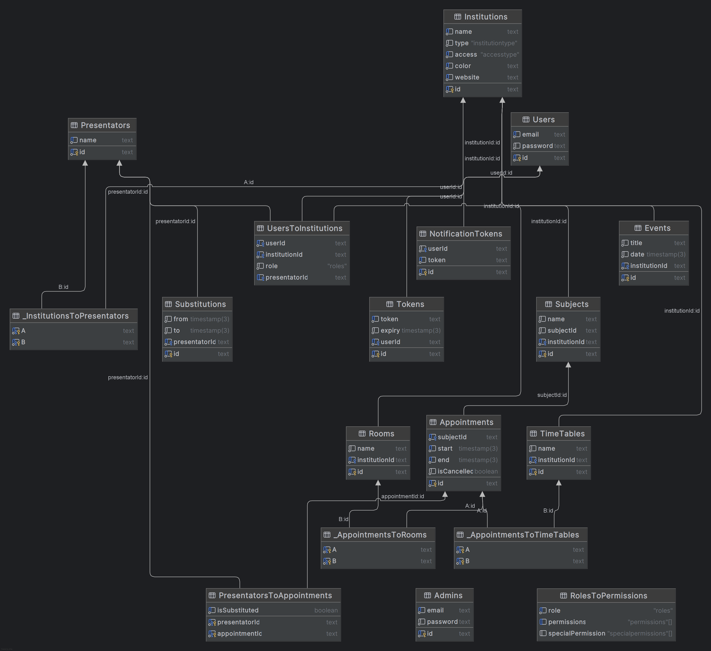

# Planora
This repository contains important files related to **Planora**, a comprehensive all-in-one institution management system.

## Database Model: Planora-Database_Model.png
The database model of the project is represented visually in the image below.



This diagram provides a detailed view of the database schema, including tables, relationships, and key data structures used within the application.

## Database Dump: Planora-PostgreSQL_Dump.sql
The `Planora-PostgreSQL_Dump.sql` file contains the complete PostgreSQL dump of the database, including the database creation, tables, relationships, and sample data.

### How to Use the SQL Dump
To import the database structure into your PostgreSQL instance, you can use the following command:
```bash
psql -U your-username -f path/to/Planora-PostgreSQL_Dump.sql
```

## Manual Tests: Planora-Web_Frontend-Manual_Testing.xlsx, Planora-Mobile_Frontend-Manual_Testing.pdf
The `Planora-Web_Frontend-Manual_Testing.xlsx` and `Planora-Mobile_Frontend-Manual_Testing.pdf` files contains comprehensive manual testing for the web, mobile frontend and for the backend.

## Web Frontend Documentation: Planora-Web_Frontend-Documentation.pdf
The `Planora-Web_Frontend-Documentation.pdf` file provides a detailed guide to the architecture and implementation of the web frontend.
